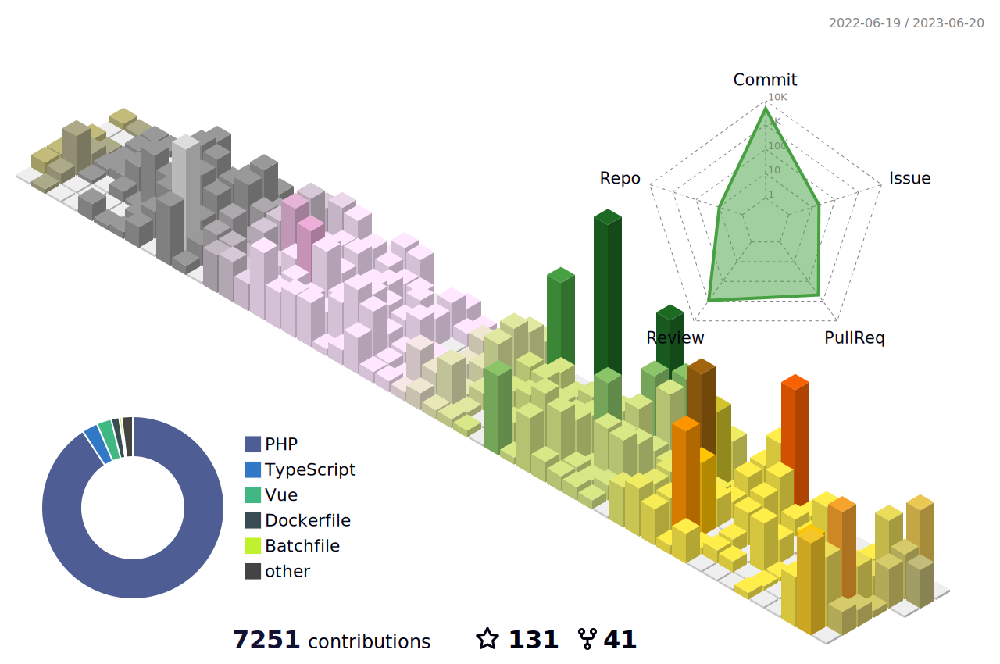

```php
<?php

namespace AndreyHelldar;

/*
 * Always write code like it’s going to be supported by an unstable,
 * violent psychopath who knows where you live.
 */
class About extends Me
{
    /** @return Collection<Organization> */
    public function getOrganizations(): Collection
    {
        return collect([
            ['The Dragon Code',  'https://github.com/TheDragonCode'],
            ['Laravel Lang',     'https://github.com/Laravel-Lang'],
            ['Laravel Cashbox',  'https://github.com/cashbox-laravel'],
            ['Volunteers CRM',   'https://github.com/volunteers-crm'],
            ['Package Wizard',   'https://github.com/package-wizard'],
            ['Laraberries',      'https://github.com/Laraberries'],
        ])->mapInto(Organization::class);
    }

    /** @return Collection<Project> */
    public function getTheBestProjects(): Collection
    {
        return collect([
            ['Laravel Actions',          'https://github.com/TheDragonCode/laravel-actions'],
            ['Laravel Migrate DB',       'https://github.com/TheDragonCode/migrate-db'],
            ['Laravel Lang Publisher',   'https://github.com/Laravel-Lang/publisher'],
            ['Laravel Cashbox',          'https://github.com/cashbox-laravel'],
            ['Laravel Pretty Routes',    'https://github.com/TheDragonCode/pretty-routes'],
            ['Laravel Env Sync',         'https://github.com/TheDragonCode/env-sync-laravel'],
            ['Laravel HTTP Logger',      'https://github.com/TheDragonCode/laravel-http-logger'],
            ['Laravel JSON Response',    'https://github.com/TheDragonCode/laravel-json-response'],
            ['Laravel Cache',            'https://github.com/TheDragonCode/laravel-cache'],
            ['Simple DTO',               'https://github.com/TheDragonCode/simple-data-transfer-object'],
            ['Which Color',              'https://github.com/TheDragonCode/which-color'],
        ])->mapInto(Project::class);
    }

    /** @return array<string> */
    public function getDailyKnowledge(): array
    {
        return [
            'laravel', 'php', 'docker', 'mysql', 'redis',
            'elasticsearch', 'vuejs', 'git', 'jira', 'gitlab'
        ];
    }

    /** @return Collection<Profile> */
    public function getProfiles(): Collection
    {
        return collect([
            'Website'    => 'https://dragon-code.pro',
            'HabrCareer' => 'https://career.habr.com/helldar',
            'LinkedIn'   => 'https://www.linkedin.com/in/helldar',
        ])->mapInto(Profile::class);
    }

    /** @return Collection<Contact> */
    public function getContacts(): array
    {
        return collect([
            'Email'    => 'helldar@dragon-code.pro',
            'Telegram' => 'https://t.me/Helldar',
        ])->mapInto(Contact::class);
    }

    /** @return array<string> */
    public function getSponsor(): array
    {
        return [
            'https://github.com/sponsors/TheDragonCode',
            'https://yoomoney.ru/to/410012608840929',
            'https://boosty.to/dragon-code',
            'https://www.donationalerts.com/r/dragon_code',
        ];
    }
}
```


